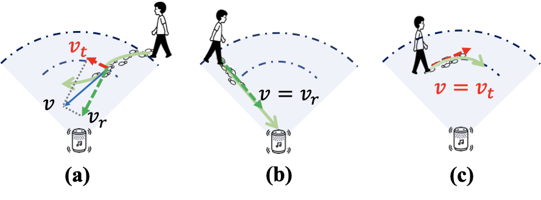

<div align="center"> 

# ASE: Practical Acoustic Speed Estimation Beyond Doppler via Sound Diffusion Field
</div>

<div align="center">   

[](https://arxiv.org/abs/2412.20142)  [](https://www.gnu.org/licenses/gpl-3.0)

</div>

<div align="center">
    <a href=https://research.ethanlyu.top/>
        Sheng Lyu
    </a>
    ,
    <a href=https://cswu.me/>
        Chenshu Wu
    </a>
</div>

<div align="center">

The University of Hong Kong
</div>
The official implementation of ASE: Practical Acoustic Speed Estimation Beyond Doppler via Sound Diffusion Field, accepted by ACM IMWUT / UbiComp 2025.

<p align="center">
    
</p>

**ASE vs. DFS.** Walking speed $\vec{v}$ can be decomposed to radial speed $v_r$ and tangent speed $v_t$. DFS can only capture radial speed $v_r$, but fails to capture $v_t$. Conversely, ASE can capture both $v_r$ and $v_t$, a complete estimation of $v$.


---

## Abstract
Passive human speed estimation plays a critical role in acoustic sensing. Despite extensive study, existing systems, however, suffer from various limitations: First, previous acoustic speed estimation exploits Doppler Frequency Shifts (DFS) created by moving targets and relies on microphone arrays, making them only capable of sensing the radial speed within a constrained distance. Second, the channel measurement rate proves inadequate to estimate high moving speeds. To overcome these issues, we present ASE, an accurate and robust Acoustic Speed Estimation system on a single commodity microphone. We model the sound propagation from a unique perspective of the **acoustic diffusion field**, and infer the speed from the acoustic spatial distribution, a completely different way of thinking about speed estimation beyond prior DFS-based approaches. We then propose a novel **Orthogonal Time-Delayed Multiplexing (OTDM) scheme** for acoustic channel estimation at a high rate that was previously infeasible, making it possible to estimate high speeds. We further develop novel techniques for motion detection and signal enhancement to deliver a robust and practical system. We implement and evaluate ASE through extensive real-world experiments. Our results show that ASE reliably tracks walking speed, independently of target location and direction, with a mean error of 0.13 m/s, a reduction of 2.5x from DFS, and a detection rate of 97.4% for large coverage, e.g., free walking in a 4m × 4m room. We believe ASE pushes acoustic speed estimation beyond the conventional DFS-based paradigm and will inspire exciting research in acoustic sensing.

---
## Setup Instructions
To get started with ASE, follow these steps:
1. Clone the GitHub repository:
``` bash
git clone https://github.com/aiot-lab/ASE.git
cd ASE
```

2. Make sure you have installed uv for virtual environment, and then run
``` bash
uv sync
```
3. Activate the virtual environment
```bash
source .venv/bin/activate
```

## Run the code

We provide two modes to run the code.

- UI Version:
    We use streamlit to build a webUI of ASE. You can use it to do the experiments and visualize the analysis results.
    To start the UI, run
    ```bash
    streamlit run app.py
    ```
    New recordings would be added to ```data``` folder and will be assigned with a unique index.
- Headless Analysis Version:
   To run the analysis in the headless mode, run
   ```bash
   python main.py analysis --config config_file/speed_gui.json --rec-idx 28
   ```
   Make sure you have the corresponding data in the ```data``` folder and input the rec-idx (a.k.a the index) you want to analyze. 

## Repository Structure
```
.
├── README.md
├── app.py
├── app_utils.py
├── audio
│   ├── Audio.py
│   ├── AudioProcessing.py
│   ├── Wave.py
│   ├── __init__.py
│   └── helpers.py
├── check_param.py
├── config_file
│   └── speed_gui.json
├── config_gui.py
├── data
│   ├── speed_Kasami_micArray RAW SPK_micArray RAW SPK_20250410-233950_28
│   └── speed_Kasami_micArray RAW SPK_micArray RAW SPK_20250410-234131_29
├── data_play
├── dataloader.py
├── fig
│   └── dfs_acf_all.png
├── index_manager.py
├── main.py
├── model
│   ├── ACF.py
│   ├── __init__.py
│   ├── acf_benchmark.py
│   ├── acf_wrapper.py
│   ├── alignment.py
│   ├── helpers.py
│   ├── optimized_acf.py
│   ├── save.py
│   └── timestamp.py
├── parser_config.py
├── pyproject.toml
├── utils.py
├── utils_gui.py
├── uv.lock
└── vis
    ├── __init__.py
    ├── vis_utils.py
    └── visual.py
```

---

## Citation
```
@article{lyu2025ase,
  title={ASE: Practical Acoustic Speed Estimation Beyond Doppler via Sound Diffusion Field},
  author={Lyu, Sheng and Wu, Chenshu},
  journal={Proceedings of the ACM on Interactive, Mobile, Wearable and Ubiquitous Technologies},
  volume={9},
  number={3},
  pages={1--31},
  year={2025},
  publisher={ACM New York, NY, USA}
}
```

## License
This project is licensed under the GNU General Public License v3.0 - see the [LICENSE](LICENSE) file for details.